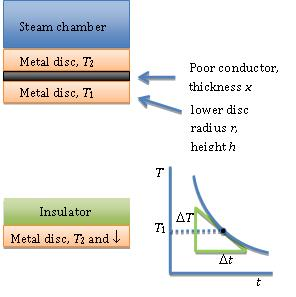
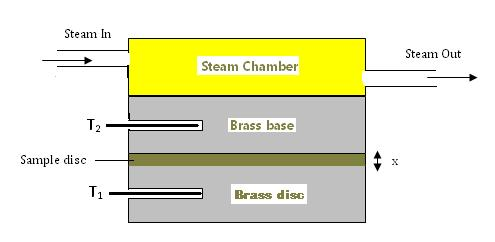
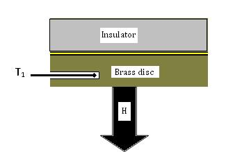
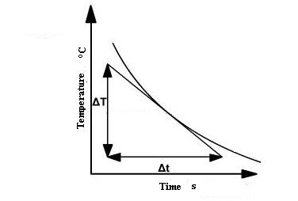

### Theory

  The Lee’s Disc experiment determines an approximate value for the thermal conductivity <em>k</em> of a poor conductor like glass, cardboard, etc. The procedure is to place a disc made of the poor conductor, radius <em>r</em> and thickness <em>x</em>, between a steam chamber and two good conductivity metal discs (of the same metal) and allow the setup to come to equilibrium, so that the heat lost by the lower disc to convection is the same as the heat flow through the poorly conducting disc. 

  The upper disc temperature <em>T2</em> and the lower disc temperature <em>T1</em> are recorded. The poor conductor is removed and the lower metal disc is allowed to heat up to the upper disc temperature <em>T2</em>. Finally, the steam chamber and upper disc are removed and replaced by a disc made of a good insulator. The metal disc is then allowed to cool through <em>T1 &lt; T2</em> and toward room temperature <em>T0</em>. 

  The temperature of the metal disc is recorded as it cools so a cooling curve can be plotted. Then the slope <em>s1 = ΔT⁄Δt</em> of the cooling curve is measured graphically where the curve passes through temperature <em>T1</em>.

Figure 1: Arrangement of conductor and disc in the Lee's Disc experiment 

At the steady state, rate of heat transfer (H) by conduction is given by;

$$H = kA \left[ \frac{T_2 - T_1}{x} \right]$$

<strong>Where,</strong>

<ul>
  <li><em>k</em> – Thermal conductivity of the sample</li>
  <li><em>A</em> – Cross-sectional area</li>
  <li><em>T2 - T1</em> – Temperature difference across the sample</li>
  <li><em>x</em> – Thickness of the bad conductor (see figure 1)</li>
</ul>

  The sample is an insulator. It is in the form of a thin disc with large cross-sectional area 
  (<em>A = πr²</em>) compared to the area exposed at the edge 
  (<em>a = 2πrx</em>) in order to reduce the energy loss.

  The rate of energy transfer across the sample can be increased by keeping <em>x</em> small and <em>A</em> large.
  Keeping <em>x</em> small means the apparatus will reach a steady state quickly.

Figure 2: Schematic representation of the Lee's Disc experiment 

  The thin sample disc is sandwiched between the brass disc and the brass base of the steam chamber (see figure 2). 
  The temperature of the brass disc is measured by thermometer <em>T1</em> and the temperature of the brass base is measured by thermometer <em>T2</em>. 
  In this way, the temperature difference across such a thin disc of the sample can be accurately measured.

Figure 3: Heat loss through the disc

  The temperatures <em>T1</em> and <em>T2</em> are constant when the apparatus is in a steady state. 
  Then the rate of heat conducted through the brass disc must be equal to the rate of heat loss due to cooling from the bottom of the brass disc by air convection. 
  By measuring how fast the brass disc cools at the steady-state temperature <em>T1</em>, the rate of heat loss can be determined. 
  It is shown in figure 3. If the disc cools down at a rate $\frac{dT}{dt}$,then the rate of heat loss is given by:

$$H=mc\frac{dT}{dt}$$

<strong>Where,</strong>

<ul>
  <li><em>m</em> – Mass of the brass disc</li>
  <li><em>c</em> – Specific heat capacity of brass</li>
</ul>

  At steady state, the heat conducted through the bad conductor per second will be equal to the heat radiated per second from the exposed portion of the metallic disc.

$$kA\left[\frac{T_2-T_1}{x}\right]=mc\frac{dT}{dt}$$
$$k=\frac{mc\frac{dT}{dt}}{A\left(\frac{T_2-T_1}{x}\right)}$$

<strong>Where,</strong>

<ul>
  <li><em>k</em> – Coefficient of thermal conductivity of the sample</li>
  <li><em>A</em> – Area of the sample in contact with the metallic disc</li>
  <li><em>x</em> – Thickness of the sample</li>
  <li><em>T2 - T1</em> – Temperature difference across the sample thickness</li>
  <li><em>m</em> – Mass of the metallic disc</li>
  <li><em>c</em> – Heat capacity of the metallic disc</li>
  <li><em>dT/dt</em> – Rate of cooling of the metallic disc at <em>T2</em></li>
</ul>

