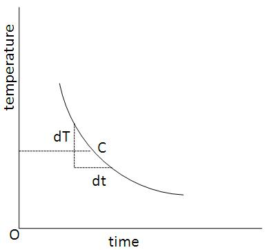

### Procedure

### Apparatus:

  Lee's disc apparatus consists of a metallic disc resting on a 5&nbsp;cm deep hollow cylinder (steam chamber) of the same diameter. 
  It has inlet and outlet tubes for steam. In addition, it has radial holes to insert thermometers.

  Thermal conductivity is the property of a material that indicates its ability to conduct heat.
  When steam is passed through the cylindrical vessel, a steady state is reached soon.
  At the steady state, the heat conducted through the bad conductor is equal to the heat radiated from the Lee's disc.

## Procedure for Performing Simulation
<ol>
  <li>Select the disc material from the drop-down combo box.</li>
  <li>Adjust the disc's mass, height, and radius using the sliders.</li>
  <li>Select the insulator from the drop-down combo box.</li>
  <li>Adjust the thickness of the insulator.</li>
  <li>Place the insulator by clicking the 'Place Insulator' button.</li>
  <li>After placing the insulator, start the steamer by clicking the 'Start Steam' button.</li>
  <li>After some time, the heat chamber temperature (<em>T1</em>) and the Lee's disc temperature (<em>T2</em>) will become steady.</li>
  <li>Remove the object from the Lee's disc by clicking the 'Remove Insulator' button (the 'Place Insulator' button changes to 'Remove Insulator' after step 5).</li>
  <li>When <em>T2</em> rises to 10°C above the steady temperature, stop the heater using the 'Stop Steam' button.</li>
  <li>The temperature at the Lee's disc will start to drop. Start the stopwatch and note the temperature at <em>T2</em> from 5°C above to 5°C below the steady temperature at 30-second intervals. Plot a graph using these points to find <em>dT/dt</em> and calculate the <em>k</em> value.</li>
  <li>Click on the 'Show Graph' checkbox to view the graph.</li>
</ol>

## Procedure for Real Lab
<ol>
  <li>Determine the mean thickness of the metal disc and bad conductor using a screw gauge.</li>
  <li>Determine the diameter of the metal disc and bad conductor using vernier calipers.</li>
  <li>Find the mass <em>M</em> of the metal disc using a balance.</li>
  <li>Place the bad conductor between the metal disc and the steam chamber.</li>
  <li>Insert thermometers through holes in the steam chamber and in the metal disc.</li>
  <li>Pass steam through the chamber until the thermometer readings become steady and note the steady temperatures.</li>
  <li>Remove the bad conductor.</li>
  <li>Remove the steam chamber when the temperature of the metal disc is 10°C above its steady temperature.</li>
  <li>Start a stopwatch and record time-temperature data until the temperature of the disc falls 10°C below its steady-state value.</li>
  <li>Plot a time-temperature graph.</li>
</ol>
 

## Observations
 
### Find the Rate of Cooling:

<table>
  <tr>
    <th>Time (s)</th>
    <th>Temperature (°C)</th>
  </tr>
  <tr>
    <td>30
    </td>
    <td>
    </td>
  </tr>
  <tr>
    <td>60 </td>
    <td> </td>
  </tr>
  <tr>
    <td>90 </td>
    <td> </td>
  </tr>
  <tr>
    <td>... </td>
    <td> </td>
  </tr>
</table>

  
 

## Calculation

<strong>From the graph,</strong>

<em>ΔT</em> = .......... °C

<em>Δt</em> = .......... s

<em>dT/dt</em> = .......... °C·s−1

 

Specific heat capacity of the metal disc <em>c</em> = .......... J·kg−1·K−1

Coefficient of thermal conductivity of the given material <em>k</em> = .......... W·m−1·K−1

$$k=\frac{mc\left(\frac{dT}{dt}\right)x}{\pi^2(T_2-T_1)}\times\left[\frac{r+2h}{2(r+h)}\right]$$

## Result

Coefficient of thermal conductivity of the given material, <em>k</em> = .......... W·m−1·K−1

